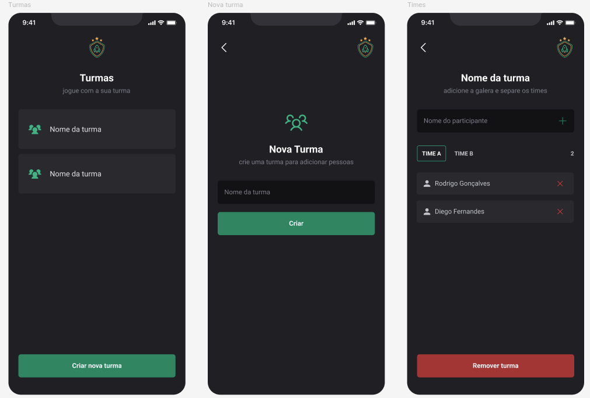

<h1 align="center">Ignite-teams | react-native-js</h1>

 
  

&#xa0;

## :dart: About ##

The application consists of a team manager for playing with friends.

In each group created, it's possible to divide people into two different teams.

This allows adding and removing groups and people from the groups.

## :rocket: Technologies ##

The following tools were used in this project:

- [React Native](https://reactnative.dev/)
- [TypeScript](https://www.typescriptlang.org/)
- [Styled Components](https://styled-components.com/)

Made by <a href="https://github.com/Adriano-Santtos" target="_blank">Adriano Santtos</a>

&#xa0;

<a href="#top">Back to top</a>
